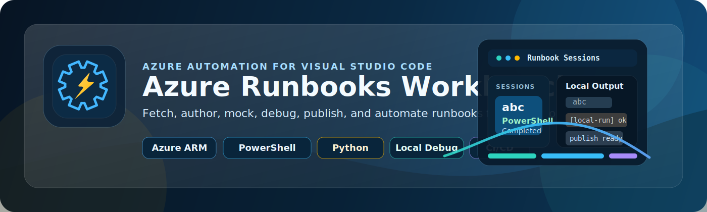

<p align="center">
  
</p>

# Azure Runbooks Workbench

> A modern VS Code extension for Azure Automation runbook development - workspace-first, Azure-connected, and built for local authoring, testing, debugging, and deployment.

## Overview

Azure Runbooks Workbench brings Azure Automation development into Visual Studio Code. Instead of jumping between the Azure portal, scripts, and local folders, you can browse Automation Accounts, fetch runbooks, edit them locally, compare them with deployed versions, upload drafts, publish changes, test locally with mocked assets, and generate CI/CD starter pipelines from one place.

The extension is designed around a workspace-first model. Runbooks live as normal source files in your repo, while Azure remains the system you fetch from, validate against, and deploy to. Account metadata, cache data, mock templates, generated mocks, and isolated PowerShell modules now live under `aaccounts`, so the development experience stays structured and repeatable.

I have been working with Azure Automation since the service was first introduced, and one thing that kept frustrating me was the constant back and forth with the Azure portal, or trying VS Code extensions that simply did not work the way a real development workflow needs them to. There is an older Azure Automation extension referenced on GitHub, but it has not been updated in a long time and its source code is not available. This extension was built as a more practical, modern, and openly maintainable alternative for people who want Azure Automation development to feel like proper software engineering instead of trial and error in the portal.

## What It Does

- Browse Azure subscriptions, Automation Accounts, runbooks, schedules, assets, modules, Python packages, runtime environments, recent jobs, and hybrid worker groups.
- Initialize a workspace and link one or more Automation Accounts to your local folder.
- Fetch published and draft runbooks into a local source structure.
- Create new runbooks directly from VS Code.
- Upload local changes as draft or publish them to Azure Automation.
- Compare local files against deployed content.
- Run PowerShell runbooks locally with mocked Automation assets.
- Debug local runbooks from VS Code, including `F5` support on open runbook files.
- Stream local execution output into the `Runbook Sessions` panel.
- Save PowerShell modules into a workspace-local sandbox using `Save-Module`.
- Generate starter GitHub Actions and Azure DevOps deployment pipelines.

## Current Status

- PowerShell is the primary and most mature path today.
- Python support is available for fetch, create, upload, publish, local run, and local debug, but it is still in testing.

## Why This Extension Exists

Azure Automation teams often end up with fragmented workflows:

- authoring in one place
- testing in another
- deployment handled by separate scripts
- local debugging either missing or inconsistent

Azure Runbooks Workbench closes that gap by treating runbooks like source code while still staying deeply connected to Azure Automation. The goal is to make runbook development feel more like modern software engineering and less like portal-only administration.

## Core Workflow

1. Sign in to Azure.
2. Browse subscriptions and Automation Accounts.
3. Initialize a local runbook workspace.
4. Fetch one or more runbooks.
5. Edit locally as normal `.ps1` or `.py` files.
6. Run or debug locally with asset mocks.
7. Upload as draft, compare, and publish when ready.
8. Generate CI/CD scaffolding when you want to automate deployment.

## Workspace Structure

The extension creates a predictable local structure like this:

```text
<workspace>/
- aaccounts/
  - .settings/
    - aaccounts.json
    - cache/
      - workspace-cache/
      - modules/
    - mocks/
  - <accountName>/
    - Runbooks/
  - mocks/
    - generated/
- local.settings.json
```

Notes:

- `aaccounts/` contains the runbook files you actively edit.
- `.settings/aaccounts.json` stores linked account metadata, runbook type metadata under `runbooks`, and deploy hashes under `sync`.
- `.settings/cache/workspace-cache/` stores fetched non-runbook account resource data.
- `.settings/mocks/` stores the editable mock templates used for local runs.
- `aaccounts/mocks/generated/` stores rendered local mock files.
- `.settings/cache/modules/` is the isolated PowerShell module sandbox for local run and debug.
- Local-only generated content is automatically added to `.gitignore`.

## Local Development Features

### Run Locally

The extension can execute local runbooks with injected mock data so you can validate logic before pushing changes back to Azure.

For PowerShell, the extension renders mock modules for:

- Azure Automation asset cmdlets
- PnP PowerShell managed identity connection helpers
- Microsoft Graph PowerShell managed identity connection helpers

For Python, the extension generates a local stub module from template-based mock files. This path is working but still considered in testing.

### Debug Locally

You can debug a runbook directly from VS Code:

- use `Debug Locally (with Asset Mocks)`
- or press `F5` with a runbook file open

PowerShell debugging uses the PowerShell debugger flow. Python debugging uses the Python debugger path.

### Isolated PowerShell Modules

If a local debug session needs real PowerShell modules, the extension can save them into:

```text
.settings/cache/modules
```

This avoids polluting your normal PowerShell environment and keeps module dependencies scoped to the workspace.

## Azure Integration

The extension supports:

- Azure sign-in through VS Code authentication
- Azure CLI fallback for ARM token acquisition when needed
- direct Azure Automation operations such as create, fetch, upload draft, publish, delete, and test job actions
- multiple Azure cloud environments

## Included Documentation

More detailed project documentation is available in the [`docs/`](/home/scoutman/github/azrunbooks-workbench/docs) folder:

- [Overview.md](/home/scoutman/github/azrunbooks-workbench/docs/Overview.md)
- [Architecture.md](/home/scoutman/github/azrunbooks-workbench/docs/Architecture.md)
- [Commands.md](/home/scoutman/github/azrunbooks-workbench/docs/Commands.md)
- [Configuration.md](/home/scoutman/github/azrunbooks-workbench/docs/Configuration.md)
- [Workflow.md](/home/scoutman/github/azrunbooks-workbench/docs/Workflow.md)
- [Testing.md](/home/scoutman/github/azrunbooks-workbench/docs/Testing.md)
- [docs/howto/HowTo.md](/home/scoutman/github/azrunbooks-workbench/docs/howto/HowTo.md)

## Build And Test

```bash
npm run compile
npm run build
npm test
```

For Azure-backed validation:

```bash
npm run test:e2e
```

## Author

**Rodrigo Pinto**  
Enterprise Architect at Perspective Dragon  
[Microsoft MVP](https://mvp.microsoft.com/en-US/MVP/profile/77bb70c0-3c9a-e411-93f2-9cb65495d3c4) in Azure and Microsoft 365 since 2011


Author of [Mastering Microsoft 365 and SharePoint Online](https://www.amazon.com/Mastering-Microsoft-SharePoint-Online-organizational/dp/1835463657)

- X: `@scoutmanpt`
- LinkedIn: https://www.linkedin.com/in/rodrigomgpinto
- Email: rpinto@pdragon.co

## License

See [LICENSE](/home/scoutman/github/azrunbooks-workbench/LICENSE).
