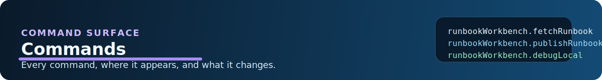

# Azure Runbooks Workbench - Commands

## Command Table

| Command ID | Title | Triggered From | Behavior |
| --- | --- | --- | --- |
| `runbookWorkbench.signIn` | Sign in to Azure | Command palette, account view title, sign-in node | Starts Azure sign-in and refreshes the accounts tree. |
| `runbookWorkbench.signOut` | Sign out of Azure | Command palette | Clears the current session and refreshes the accounts tree. |
| `runbookWorkbench.selectCloud` | Select Azure Cloud | Command palette | Switches Azure cloud environment and forces re-authentication. |
| `runbookWorkbench.refresh` | Refresh | Accounts view title, command palette | Refreshes the Azure-side tree. |
| `runbookWorkbench.initWorkspace` | Initialize Runbook Workspace | Automation Account context menu, command palette | Links an Automation Account to the current folder and creates local workspace files. |
| `runbookWorkbench.fetchRunbook` | Fetch Runbook(s) (Published) | Runbook context menus, file explorer, command palette | Downloads published content into the local workspace. |
| `runbookWorkbench.fetchDraftRunbook` | Fetch Runbook(s) (Draft) | Runbook context menus, file explorer, command palette | Downloads draft content into the local workspace. |
| `runbookWorkbench.publishRunbook` | Publish Runbook(s) | Runbook context menus, file explorer, command palette | Uploads local content as draft, then publishes it. |
| `runbookWorkbench.uploadAsDraft` | Upload as Draft(s) | Runbook context menus, file explorer, command palette | Uploads local content to Azure draft state. |
| `runbookWorkbench.diffRunbook` | Compare Local vs Deployed | Runbook context menus, file explorer, command palette | Opens a VS Code diff between local and remote content. |
| `runbookWorkbench.startJob` | Start Automation Job | Runbook context menus, file explorer, command palette | Currently shows a not-yet-supported message. |
| `runbookWorkbench.startTestJob` | Start Test Job | Runbook context menus, file explorer, command palette | Uploads local draft content if present, then starts an Azure Automation test job. |
| `runbookWorkbench.stopTestJob` | Stop Test Job | Runbook context menu, command palette | Stops the current Azure test job for the selected runbook. |
| `runbookWorkbench.runLocal` | Run Locally (with Asset Mocks) | Runbook context menus, file explorer, command palette | Executes a local PowerShell or Python runbook with injected mocks. |
| `runbookWorkbench.debugLocal` | Debug Locally (with Asset Mocks) | Runbook context menus, file explorer, `F5` on runbook files, command palette | Starts a local debug session with injected mocks. |
| `runbookWorkbench.createRunbook` | Create New Runbook | Runbooks folder context menu, command palette, internal prefill flows | Creates a new Azure runbook and then fetches the draft locally. |
| `runbookWorkbench.deleteRunbook` | Delete Runbook(s) | Runbook context menus, file explorer, command palette | Deletes a runbook locally and remotely, including multi-select bulk delete. |
| `runbookWorkbench.openLocalSettings` | Open local.settings.json | Command palette | Opens the local mock settings file. |
| `runbookWorkbench.initAndFetchAllInSubscription` | Initialize All Accounts and Fetch All | Subscription context menu, command palette | Initializes every account in a subscription and fetches all supported resources. |
| `runbookWorkbench.fetchAllRunbooks` | Fetch All Runbooks | Automation Account context menu, command palette | Fetches all runbooks for one Automation Account. |
| `runbookWorkbench.generateCiCd` | Generate CI/CD Pipeline | Automation Account context menu, command palette | Writes starter GitHub Actions or Azure DevOps deployment YAML. |
| `runbookWorkbench.manageAssets` | Manage Assets (Variables/Credentials) | Automation Account context menu, command palette | Inspects Azure assets and offers to seed local variable mocks. |
| `runbookWorkbench.installModuleForLocalDebug` | Install Module for Local Debug | PowerShell runbook context menus, Automation Account context menu, command palette | Saves a PowerShell module into `.settings/cache/modules` using `Save-Module`. |
| `runbookWorkbench.refreshWorkspaceRunbooks` | Refresh Workspace | Workspace view title, command palette | Refreshes the workspace tree and icon theme state. |
| `runbookWorkbench.openWorkspaceRunbook` | Open Runbook | Workspace tree | Opens the selected local runbook file. |
| `runbookWorkbench.clearRunbookSessions` | Clear Runbook Sessions | Runbook Sessions view title, command palette | Clears the session list and output in the sessions webview. |

## Command Details

### `runbookWorkbench.signIn`

- Description: Signs the user into Azure using VS Code authentication. If VS Code auth cannot provide the needed ARM token later, the extension can still fall back to Azure CLI.
- Pre-conditions: None.
- Post-conditions: Auth state is stored in memory and the accounts tree refreshes.
- Error cases: Shows `Sign-in failed` if the VS Code authentication call fails.

### `runbookWorkbench.signOut`

- Description: Clears the extension session and refreshes the account tree.
- Pre-conditions: None.
- Post-conditions: The extension considers the user signed out.
- Error cases: No special UI error path beyond the generic command wrapper.

### `runbookWorkbench.selectCloud`

- Description: Lets the user switch between Azure Commercial, Azure US Government, and Azure China endpoints.
- Pre-conditions: None.
- Post-conditions: The configured cloud changes and the user must sign in again.
- Error cases: Uses the generic command wrapper if the settings update fails.

### `runbookWorkbench.refresh`

- Description: Forces a refresh of the Azure-side `Automation Accounts` tree.
- Pre-conditions: None.
- Post-conditions: Tree items reload.
- Error cases: None beyond the generic wrapper.

### `runbookWorkbench.initWorkspace`

- Description: Creates `.settings/aaccounts.json`, `.settings/cache/`, `.settings/mocks/`, `aaccounts/mocks/generated/`, `local.settings.json`, linked account metadata, mock templates, the local module sandbox, and git ignore rules for local-only state.
- Pre-conditions: A folder must be open in VS Code and an Automation Account must be selected.
- Post-conditions: The workspace is linked and `local.settings.json` opens automatically.
- Error cases: Shows an error if no folder is open or no account was selected.

### `runbookWorkbench.fetchRunbook`

- Description: Fetches the published version of a runbook into the local workspace. If Azure returns no content stream, the extension still creates an empty file and warns the user.
- Pre-conditions: The runbook must resolve from the Azure tree, workspace tree, or file explorer context.
- Post-conditions: A local `.ps1` or `.py` file is written and opened in the editor, and the account's `runbooks` metadata in `.settings/aaccounts.json` is updated.
- Error cases: Shows fetch failure details, including 404 cases and content errors.

### `runbookWorkbench.fetchDraftRunbook`

- Description: Same as published fetch, but uses the Azure draft content endpoint.
- Pre-conditions: Same as published fetch.
- Post-conditions: Writes the local file, updates metadata, and refreshes workspace views.
- Error cases: Same fetch error flow as published fetch.

### `runbookWorkbench.publishRunbook`

- Description: Reads the local file, uploads it as draft, publishes it, and records the deployed hash locally.
- Pre-conditions: A local copy of the runbook must exist. If the Azure runbook does not exist yet, the extension can route into the create flow first.
- Post-conditions: Azure published content is updated and deploy state is recorded.
- Error cases: Shows a confirmation prompt first, then a publish error if upload or publish fails.

### `runbookWorkbench.uploadAsDraft`

- Description: Uploads the local runbook file into the Azure draft slot without publishing.
- Pre-conditions: A local copy must exist. Missing Azure runbooks can be created first through the prompted create flow.
- Post-conditions: Azure draft content is updated.
- Error cases: Shows a draft upload error when the REST call fails.

### `runbookWorkbench.diffRunbook`

- Description: Prompts the user to compare against Azure published or draft content and opens a VS Code diff.
- Pre-conditions: A local copy must exist.
- Post-conditions: A read-only remote document and the local file open in the diff editor.
- Error cases: Shows an error if remote content cannot be fetched.

### `runbookWorkbench.startJob`

- Description: Placeholder for full production job execution.
- Pre-conditions: None.
- Post-conditions: Only an informational message is shown.
- Error cases: None. The command intentionally reports that production start is not yet supported.

### `runbookWorkbench.startTestJob`

- Description: Optionally uploads the local file as draft, prompts for JSON parameters, starts a test job, and begins polling output into the extension output channel.
- Pre-conditions: The runbook must exist in Azure.
- Post-conditions: A test job starts and stream output is polled.
- Error cases: Invalid parameter JSON or Azure test job failures surface as error messages.

### `runbookWorkbench.stopTestJob`

- Description: Stops the current Azure test job for the selected runbook.
- Pre-conditions: A runbook item must be selected from the Azure tree.
- Post-conditions: The running test job is asked to stop.
- Error cases: Shows an error if the stop call fails.

### `runbookWorkbench.runLocal`

- Description: Runs a local runbook using rendered mock files and the `Runbook Sessions` panel. If the runbook does not yet exist in Azure, the command can still run from the local file and linked workspace metadata.
- Pre-conditions: A local `.ps1` or `.py` file must exist in the workspace.
- Post-conditions: A local process starts and output streams into `Runbook Sessions`.
- Error cases: Missing PowerShell or Python runtimes, missing local files, and launch failures are shown to the user.

### `runbookWorkbench.debugLocal`

- Description: Starts a PowerShell or Python debug session with injected mocks. This is also the `F5` path for runbook files.
- Pre-conditions: A local runbook file must exist. Matching debugger support must be installed in VS Code.
- Post-conditions: VS Code debugging starts against the local script.
- Error cases: Shows an error if the debugger cannot start or the required debugger extension is missing.

### `runbookWorkbench.createRunbook`

- Description: Prompts for runbook name, type, and optional description, creates the runbook in Azure, updates local metadata, and fetches the draft locally.
- Pre-conditions: Account details must be resolvable from the selected Automation Account, workspace path, or a programmatic request object.
- Post-conditions: The new Azure runbook exists and a local draft file is fetched into the workspace.
- Error cases: Shows create errors from Azure and validates the name before submission.

### `runbookWorkbench.deleteRunbook`

- Description: Deletes runbooks from both the local workspace and Azure. Bulk delete uses a single confirmation, deletes Azure first, and only removes local files for remote successes.
- Pre-conditions: The user must be signed in for remote deletion.
- Post-conditions: Azure runbooks are deleted, local files are removed, and metadata is cleaned up when appropriate.
- Error cases: Failed remote deletes are summarized in an error message instead of being hidden in logs only.

### `runbookWorkbench.openLocalSettings`

- Description: Opens the shared `local.settings.json` file that stores mock asset values per linked account.
- Pre-conditions: None.
- Post-conditions: The file opens in the editor.
- Error cases: Any file open failure is handled by the generic wrapper.

### `runbookWorkbench.initAndFetchAllInSubscription`

- Description: Finds every Automation Account in the selected subscription, initializes the workspace for each one, then fetches runbooks and supported account resources.
- Pre-conditions: A folder must be open and a subscription item must be selected.
- Post-conditions: The workspace tree and metadata are fully populated for all accounts in the subscription.
- Error cases: Shows an info message if no Automation Accounts are found.

### `runbookWorkbench.fetchAllRunbooks`

- Description: Fetches all runbooks in one Automation Account. Other account resource sections are populated by the broader fetch-all account flow.
- Pre-conditions: An Automation Account item must be selected.
- Post-conditions: Local runbook files are created for all returned runbooks, including empty ones with no content stream.
- Error cases: Reports no-runbook and fetch failures through notifications and the output channel.

### `runbookWorkbench.generateCiCd`

- Description: Generates starter deployment YAML for GitHub Actions, Azure DevOps, or both.
- Pre-conditions: At least one account must be linked in the workspace.
- Post-conditions: `.github/workflows/deploy-runbooks.yml` and or `azure-pipelines.yml` are written and opened.
- Error cases: Shows an error when there is no linked account or no workspace folder.

### `runbookWorkbench.manageAssets`

- Description: Opens a quick-pick workflow for variables and modules. For variables, it can offer to add missing values into `local.settings.json`.
- Pre-conditions: An Automation Account item must be selected.
- Post-conditions: The user can inspect asset data and optionally seed local mocks.
- Error cases: Azure list failures surface through the command wrapper.

### `runbookWorkbench.installModuleForLocalDebug`

- Description: Prompts for a PowerShell module name and optional exact version, then uses `Save-Module` to place it in `.settings/cache/modules`.
- Pre-conditions: PowerShell 7+ must be installed locally.
- Post-conditions: The module is saved into the workspace-local module sandbox and will be visible to local run and debug sessions through `PSModulePath`.
- Error cases: Shows errors for missing `pwsh` or failed `Save-Module` operations.

### `runbookWorkbench.refreshWorkspaceRunbooks`

- Description: Refreshes the workspace tree and recalculates icon theme output.
- Pre-conditions: None.
- Post-conditions: Workspace view updates.
- Error cases: None beyond the generic wrapper.

### `runbookWorkbench.openWorkspaceRunbook`

- Description: Opens the selected workspace runbook file from the custom tree.
- Pre-conditions: A workspace runbook item must be selected.
- Post-conditions: The file opens in the editor.
- Error cases: Standard file open errors bubble through the wrapper.

### `runbookWorkbench.clearRunbookSessions`

- Description: Clears the in-memory session list and output shown in the `Runbook Sessions` panel.
- Pre-conditions: None.
- Post-conditions: The sessions view resets to empty state.
- Error cases: None beyond the generic wrapper.
