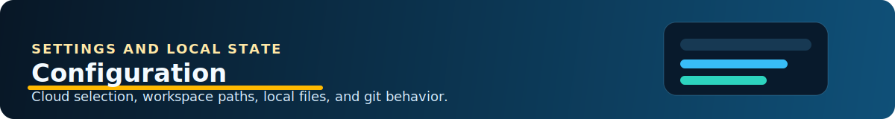

# Azure Runbooks Workbench - Configuration

## Settings

| Setting | Type | Default | Description |
| --- | --- | --- | --- |
| `runbookWorkbench.cloud` | `string` | `AzureCloud` | Selects which Azure cloud environment the extension targets. Supported values are `AzureCloud`, `AzureUSGovernment`, and `AzureChinaCloud`. |
| `runbookWorkbench.workspacePath` | `string` | `""` | Overrides the workspace root used for runbook files and `.settings/cache/`. If empty, the first VS Code workspace folder is used. |

## Configuration Defaults

The extension also contributes file associations so seeded mock template files open with script syntax coloring:

- `**/.settings/mocks/*.psm1.template` -> PowerShell
- `**/.settings/mocks/*.py.template` -> Python

## Usage Examples

### Use Azure US Government

```json
{
  "runbookWorkbench.cloud": "AzureUSGovernment"
}
```

This switches ARM endpoints and sign-in scope handling to the US Government cloud. After changing it, the extension asks the user to sign in again.

### Override The Workspace Root

```json
{
  "runbookWorkbench.workspacePath": "/path/to/my/runbook-repo"
}
```

This is useful when the folder open in VS Code is not the directory where runbook files and `.rb-workb` should live.

## Local Files The Extension Creates

These files are not extension settings, but they matter for configuration and day-to-day use:

- `local.settings.json` - Stores mock Automation variables, credentials, and connections per linked account.
- `.settings/aaccounts.json` - Stores linked Automation Account metadata, per-account `runbooks` type metadata, and per-account `sync` deploy hashes.
- `.settings/cache/workspace-cache/` - Stores fetched non-runbook account data as JSON.
- `.settings/mocks/` - Seeded source templates for local mocks.
- `aaccounts/mocks/generated/` - Rendered mock files produced for specific account/runbook runs.
- `aaccounts/mocks/generated/` - Rendered local mock files used at runtime.
- `.settings/cache/modules/` - Workspace-local PowerShell module sandbox for local run and debug.

## Git And Source Control Notes

The extension automatically adds these entries to `.gitignore` during workspace initialization:

- `local.settings.json`
- `.env`
- `.settings/cache/workspace-cache/`
- `aaccounts/mocks/generated/`
- `.settings/cache/modules/`

The checked-in source templates under `resources/mock-templates/` are intended to remain committed. The generated runtime data under `.settings/cache/` and `aaccounts/mocks/` is local workspace state and should not be committed.
