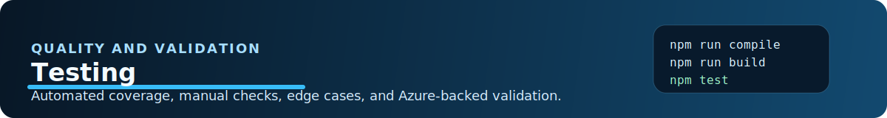

# Azure Runbooks Workbench - Testing

## Automated Test Commands

Run the main automated suite with:

```bash
npm test
```

TypeScript validation without emit:

```bash
npm run compile
```

Bundle build:

```bash
npm run build
```

End-to-end Azure-backed tests:

```bash
npm run test:e2e
```

## Unit And Integration Coverage

The main test suite uses a custom VS Code stub from [`test/mock-vscode.ts`](../test/mock-vscode.ts). That lets tests simulate:

- tree providers
- command execution
- Quick Pick and Input Box responses
- output channels
- URIs
- webview interactions
- workspace and window APIs

Covered areas include:

- account tree loading
- workspace file I/O
- fetch, publish, create, and delete flows
- runbook content edge cases such as empty content streams
- local metadata and deploy state tracking
- CI/CD YAML generation
- helper parsing and path resolution

## End-To-End Tests

`npm run test:e2e` exercises real Azure calls against configured test resources. These tests require:

- valid Azure sign-in
- access to the target subscription and Automation Accounts
- network access
- sufficient permissions to list, create, upload, publish, and delete Automation resources used by the suite

Because these tests perform live Azure operations, they are best treated as a controlled validation step rather than a default local edit loop.

## Manual Testing

Use the Extension Development Host with `F5` to validate the UI and interaction paths that are hard to cover fully in headless tests.

Recommended manual scenarios:

- Sign in, sign out, and switch Azure cloud.
- Expand subscriptions and Automation Accounts in the Azure tree.
- Initialize a workspace and confirm `.settings/aaccounts.json`, `.settings/cache/`, and `aaccounts/mocks/` are created.
- Fetch published and draft runbooks.
- Create a new runbook from the Runbooks folder.
- Upload as draft and publish from local files.
- Delete one runbook and a multi-selection of runbooks.
- Compare local vs deployed content.
- Start and stop Azure test jobs.
- Run a PowerShell runbook locally and inspect `Runbook Sessions`.
- Debug a PowerShell runbook with `F5`.
- Install a PowerShell module into `.settings/cache/modules` and confirm local run or debug picks it up.
- Run a Python runbook locally and debug it, keeping in mind that Python support is still in testing.

## Edge Cases Worth Verifying

- `.settings/aaccounts.json` or `local.settings.json` contains invalid JSON.
- No workspace folder is open.
- The selected workspace account is missing location metadata.
- A file path points outside the expected workspace accounts directory.
- Azure returns 401, 404, or an empty runbook content stream.
- VS Code auth cannot provide an ARM token and Azure CLI fallback is required.
- PowerShell or Python is not installed locally.
- The PowerShell or Python debugger extension is not available.
- A runbook exists locally but not yet in Azure.

## Test File Layout

| Test File | Coverage |
| --- | --- |
| [`test/accountsTreeProvider.test.ts`](../test/accountsTreeProvider.test.ts) | Azure account tree sections and live child loading |
| [`test/workspaceManager.test.ts`](../test/workspaceManager.test.ts) | Workspace initialization, file I/O, metadata, local settings, cache, mocks, and git ignore behavior |
| [`test/runbookCommands.test.ts`](../test/runbookCommands.test.ts) | Fetch behavior, especially empty-content runbooks |
| [`test/rbHelpers.test.ts`](../test/rbHelpers.test.ts) | Command helper resolution such as local-run fallback and path parsing |
| [`test/cicdGenerator.test.ts`](../test/cicdGenerator.test.ts) | GitHub Actions and Azure DevOps YAML generation |
| [`test/subscriptionColorRegistry.test.ts`](../test/subscriptionColorRegistry.test.ts) | Stable subscription color assignment |
| [`test/e2e.test.ts`](../test/e2e.test.ts) | Azure-backed end-to-end scenarios across auth, fetch, create, publish, and delete flows |
| [`test/mock-vscode.ts`](../test/mock-vscode.ts) | VS Code API stub used by the automated suite |

## Practical Testing Notes

- The PowerShell path is the primary local-run and local-debug path today.
- Python support is present but should still be treated as testing-stage functionality.
- Generated runtime artifacts under `.settings/cache/` are local state and should not be committed.
