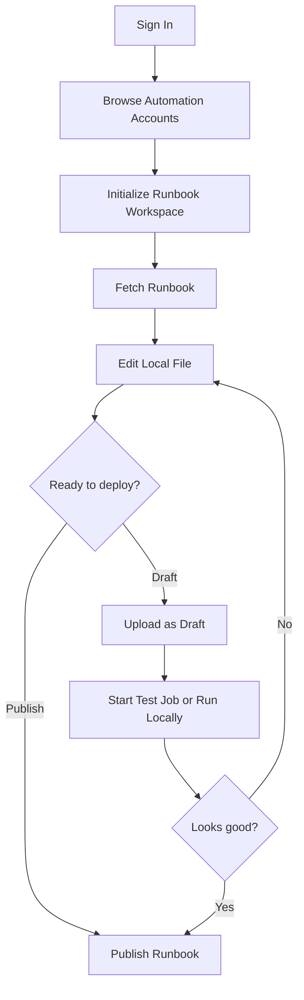

# Azure Runbooks Workbench - Workflow

## Installation And First Launch

After the extension is installed, it contributes an activity-bar container named `Azure Runbooks Workbench` and a bottom panel named `Runbook Sessions`. The main side views are:

- `Automation Accounts` - Azure-first browsing of subscriptions, accounts, runbooks, and account resources
- `Workspace` - local workspace files and fetched section data

The extension does not require a sign-in at install time, but the Azure-side tree will prompt for sign-in when needed.

## Authentication

Authentication is handled by [`src/authManager.ts`](../src/authManager.ts):

1. The extension asks VS Code's built-in Microsoft authentication provider for a token scoped to Azure Resource Manager.
2. If the provider cannot supply a token for that scope, the extension falls back to:

```bash
az account get-access-token --resource <resource-manager-endpoint>
```

3. The selected cloud determines the ARM endpoint and audience.

Supported clouds:

- Azure Commercial
- Azure US Government
- Azure China

## Workspace Initialization

`Initialize Runbook Workspace` links an Automation Account to the current folder and creates the local structure:

```text
<workspace>/
- aaccounts/
  - <accountName>/
    - Runbooks/
    - pipelines/
      - scripts/
      - biceps/
      - jsons/
      - modules/
  - mocks/
    - generated/
- .settings/aaccounts.json
- local.settings.json
- .settings/cache/
  - workspace-cache/
  - modules/
```

During initialization the extension also:

- seeds local mock templates from `resources/mock-templates/`
- creates the PowerShell module sandbox directory
- writes `.gitignore` entries for local-only generated data

## Fetching Runbooks

### Single Fetch

From the Azure tree, workspace tree, or file explorer, the user can fetch:

- published content
- draft content

Files are written under:

```text
aaccounts/<account>/Runbooks/
```

If Azure returns a runbook with no content stream, the extension still creates an empty local file and warns the user. This is important for newly created or not-yet-authored workflows.

### Fetch All

The extension supports account-wide fetch flows:

- `Fetch All Runbooks`
- `Initialize All Accounts and Fetch All`

Non-runbook resource sections are written to hidden JSON cache under:

```text
.settings/cache/workspace-cache/<account>/<section>/
```

This keeps the File Explorer focused on runbook source while still powering the custom workspace view.

## Editing And Publishing

The normal edit loop is:

1. Fetch a runbook.
2. Edit the local `.ps1` or `.py` file.
3. Compare local content with the deployed published or draft version.
4. Upload as draft or publish directly.

If the user tries to upload or publish a local file whose Azure runbook does not exist yet, the extension can route into the `Create New Runbook` flow and prefill:

- runbook name
- inferred type from file extension or workspace metadata
- optional description when passed programmatically

The `runbooks` property inside `.settings/aaccounts.json` is updated whenever runbooks are created, fetched, or deleted so runtime badges and file handling stay in sync. The `sync` property stores the last deployed content hash per runbook.

## Running And Testing

### Azure Test Jobs

`Start Test Job` uploads the current local file as draft if present, then starts an Azure Automation test job and polls its output into the extension output channel.

### Local Run

`Run Locally (with Asset Mocks)` executes the local script using mock assets:

- PowerShell uses rendered `.psm1` mocks and imports them before the runbook
- Python uses a stub module written from the Python template

Session output appears in the bottom `Runbook Sessions` panel.

### Local Debug

`Debug Locally (with Asset Mocks)` and `F5` on an open runbook start a local debug session:

- PowerShell launches through the PowerShell debugger
- Python launches through `debugpy`

Python local run and debug are available but still in testing.

## Local Module Isolation

For PowerShell debugging, the extension can save required modules into:

```text
.settings/cache/modules
```

This path is prepended to `PSModulePath` for local run and debug sessions so the workspace can stay isolated from the machine-wide PowerShell environment.

The `Install Module for Local Debug` command uses `Save-Module`, not `Install-Module`.

## Asset Management

`Manage Assets (Variables/Credentials)` currently focuses on:

- listing Automation variables
- listing imported PowerShell modules
- offering to copy missing variable values into `local.settings.json` for local mocks

This is a local development helper, not a full Azure asset editor.

## CI/CD Generation

`Generate CI/CD Pipeline` writes a complete deployment pipeline for:

- GitHub Actions (`.github/workflows/deploy-<account>.yml`)
- Azure DevOps (`azure-pipelines-<account>.yml` at repo root)

The pipeline is built around a single orchestrator script at `aaccounts/<account>/pipelines/scripts/deploy.ps1` that calls five sub-scripts in sequence:

1. **deploy-infrastructure.ps1** — deploys the Automation Account via Bicep
2. **deploy-modules.ps1** — imports PowerShell Gallery and local modules
3. **deploy-runbooks.ps1** — creates or updates all runbook files
4. **deploy-assets.ps1** — deploys variables, credentials, connections, and certificates
5. **deploy-schedules.ps1** — creates schedules and links them to runbooks

The pipeline can also be run locally by calling `deploy.ps1` directly with `-Login` for interactive Azure authentication.

### Local Module Support

If you have local private PowerShell modules in `.settings/cache/modules/`, use the extension to add them as pipeline modules. The extension bundles them as zip files into `aaccounts/<account>/pipelines/modules/` at CI/CD generation time. During deployment, `deploy-modules.ps1` automatically creates a temporary Azure Blob Storage account, stages each zip, generates a short-lived SAS URL for import, waits for Azure Automation to finish the async import, then deletes the storage account. No extra permissions beyond `Contributor` on the resource group are required.

## Core Fetch Edit Publish Loop


